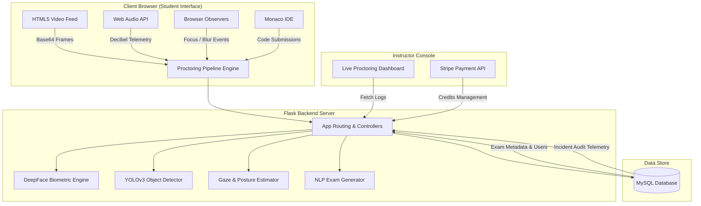

# 🎓 AI-Proctor: Next-Gen AI-Powered Online Examination & Remote Proctoring Platform

[](https://www.python.org/)
[](https://flask.palletsprojects.com/)
[](https://www.tensorflow.org/)
[](https://opencv.org/)
[](https://www.docker.com/)
[](https://www.mysql.com/)
[](https://stripe.com/)
[](LICENSE)

> **AI-Proctor** is a comprehensive, enterprise-grade online examination and automated proctoring platform. Built with Python, Flask, Computer Vision, and Deep Learning, it empowers educational institutions and organizations to deliver high-integrity assessments (Objective MCQs, Subjective Essays, and Practical Coding Exams) while enforcing automated anti-cheating controls.

---

## 🌟 Key Features

### 👁️ 1. Multi-Dimensional AI Proctoring Engine
* **Biometric Facial Verification:** Integrates **DeepFace (VGG-Face)** to verify candidate identity during check-in against registered profile pictures before granting test access.
* **3D Head Pose & Motion Analysis:** Utilizes 68-point facial landmark estimation and `solvePnP` head posture mapping to continuously track candidate head angles (pitch, yaw, roll) and flag suspicious orientation changes (*Looking Left/Right*, *Head Up/Down*).
* **Gaze & Iris Movement Tracking:** Detects eye movement patterns and iris displacement to flag when candidates look off-screen or display abnormal blinking frequencies.
* **YOLOv3 Object & Person Detection:** Scans live camera streams to detect unauthorized items (e.g., **mobile phones**) and monitors person count (flagging *No Person Present* or *Multiple People Detected*).
* **Web Audio Decibel Telemetry:** Employs browser `AudioContext` and `ScriptProcessorNode` to track background noise levels in real-time and log decibel spikes indicating verbal communication.

### 🛡️ 2. Browser Security & Behavioral Monitoring
* **Tab & Window Isolation:** Monitors `window.onblur` and visibility API events to detect tab switching, window resizing, or screen detachment in real-time.
* **Incident Audit Logs:** Generates a granular, timestamped proctoring log for every examinee, accessible via the instructor dashboard.

### 📝 3. Versatile Exam Modules
* **Objective MCQ Module:** Supports standard multiple-choice questions with embedded scientific utilities (on-screen calculator, custom timer, automatic scoring).
* **Subjective Writing Module:** Long-form conceptual answer fields with automated text parsing and instructor grading interfaces.
* **Practical Coding IDE:** Built-in code compiler environment supporting **15+ programming languages** (Python, C, C++, Java, JavaScript, etc.) for real-time coding assessments.

### 🧠 4. Intelligent NLP Test Generator (Auto-Authoring)
* **Automatic MCQ Generation:** Parses uploaded course material using **NLTK POS Tagging** and **WordNet** semantical relationships (hypernyms/hyponyms) to synthesize question stems and plausible options automatically.
* **Automatic Subjective Question Synthesizer:** Extracts core concepts from reference texts to auto-generate comprehensive evaluation questions and sample reference keys.

### 📊 5. Instructor Portal & Credit Monetization
* **Live Telemetry Dashboard:** Allows educators to monitor exam progress, review flagged incidents, and view video/audio infraction reports.
* **Stripe Payment Gateway:** Integrated payment pipeline allowing institutions to purchase examination credits securely.

---

## 🏗️ System Architecture



---

## 🛠️ Tech Stack

| Domain | Technologies Used |
| :--- | :--- |
| **Backend Framework** | Python 3.8, Flask, Flask-SQLAlchemy, Jinja2 |
| **Computer Vision & AI** | OpenCV, TensorFlow, DeepFace (VGG-Face), YOLOv3, dlib |
| **Natural Language Processing**| NLTK, WordNet |
| **Frontend & Compiler** | HTML5, Vanilla CSS3, JavaScript (ES6+), Monaco Editor, Bootstrap 5 |
| **Database & Payments** | MySQL 8.0, Stripe API |
| **DevOps & Deployment** | Docker, Docker Compose, Gunicorn |

---

## 🚀 Getting Started

### Prerequisites
* **Python:** `3.8+`
* **MySQL Server:** `5.7+` or `8.0+`
* **System Build Tools:** CMake & C++ compiler (for `dlib` compilation)
* **Docker & Docker Compose:** *(Recommended for single-command setup)*

---

### Option 1: Docker Setup (Recommended)

1. **Clone the repository:**
   ```bash
   git clone https://github.com/YourUsername/AI-Proctor.git
   cd AI-Proctor
   ```

2. **Run with Docker Compose:**
   ```bash
   docker-compose up --build
   ```
   *The application will automatically build the environment, initialize the MySQL database, download ML model weights, and host the web app at `http://localhost:5001`.*

---

### Option 2: Native Installation

1. **Create and activate a virtual environment:**
   ```bash
   python -m venv .venv
   
   # On Windows:
   .venv\Scripts\activate
   
   # On Linux/macOS:
   source .venv/bin/activate
   ```

2. **Install dependencies:**
   ```bash
   pip install --upgrade pip setuptools wheel
   pip install -r requirements.txt
   ```

3. **Database Setup:**
   Import the schema into your local MySQL server:
   ```sql
   CREATE DATABASE quizapp;
   USE quizapp;
   SOURCE DB/quizappstructure.sql;
   ```

4. **Run the Application:**
   ```bash
   python app.py
   ```
   Navigate to `http://localhost:5000` in your browser.

---

## 📁 Repository Structure

```
AI-Proctor/
├── DB/                      # Database schemas & SQL initialization scripts
├── models/                  # AI Model weights (YOLOv3, Caffe SSD, Pose models)
├── static/                  # CSS styles, images, and client-side proctoring JS scripts
│   ├── app.js               # Objective exam camera & Web Audio telemetry
│   ├── appsubjective.js     # Subjective exam monitoring script
│   └── apppractical.js      # Practical coding IDE tracking script
├── templates/               # Responsive HTML templates (Jinja2)
├── app.py                   # Main Flask web application server
├── camera.py                # Computer vision proctoring engine & frame processor
├── face_detector.py         # Face localization module
├── face_landmarks.py        # Facial landmark extractor
├── objective.py             # NLP-powered MCQ question generator
├── subjective.py            # NLP-powered Subjective question synthesizer
├── requirements.txt         # Python dependency manifest
├── Dockerfile               # Production container configuration
└── docker-compose.yml       # Multi-container service orchestrator
```

---

## 👨‍💻 Author & Maintainer

**Subham Sanket**
* **GitHub:** [@subhamsanket](https://github me/subhamsanket)
* **LinkedIn:** [Subham Sanket](https://www.linkedin.com/in/aditya-ranjan-swain/)

---

## 📄 License

This project is licensed under the **MIT License** - see the [LICENSE](LICENSE) file for complete details.
